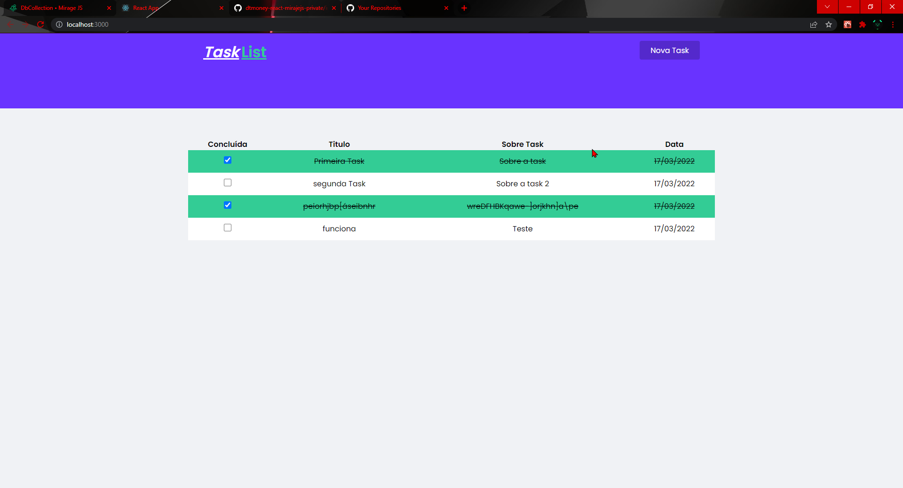
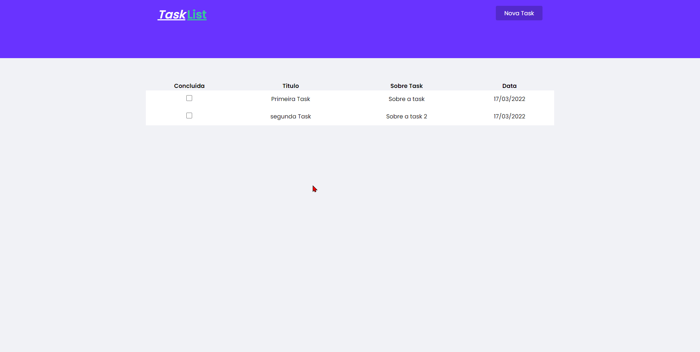

# Projeto TaskList

## Como funciona!

# Psiga os passos abaixo para utilizar o Projeto.

Para ter o projeto na sua maquina utilize o comando \
`https://github.com/RenanGava/task-list-miragejs.git`

Projeto criado para fins de estuto utilizando conceitos do 
desenvolvimento Front-End.

## Como Instalar na sua máquina
Após utilizar o commando `git clone` execute o comando \
`yarn install` ou `npm install` que irá instalar todas
as dependências necessárias para executar a aplicação

# Dependências Da aplicação
*** Foi utilizado o create react-app com template TypeScriptEntão algumas das bibliotecas utilizadas tem que instalar as tipagens fora a parte delas para funcionarem. ***

para instalar basta usar `yarn add "nome da biblioteca"`\
para instalar as tipagens utilize `yarn add @type/biblioteca`

## - styled-components: precisa das tipagens
## - miragejs: não precisa de tipagem
## - axios: não precisa de tipagem
